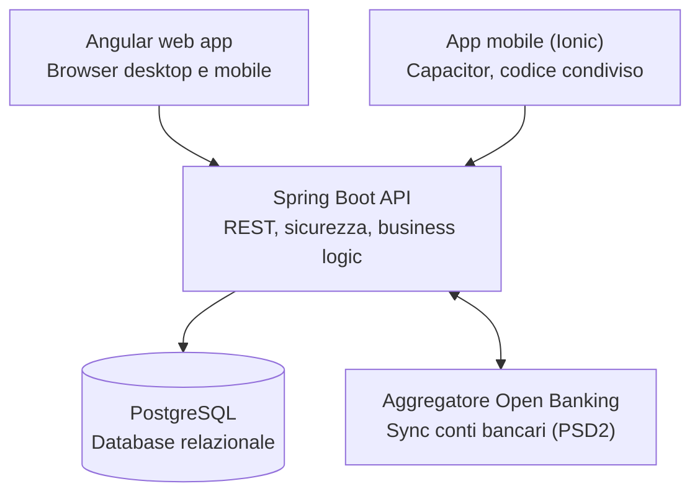
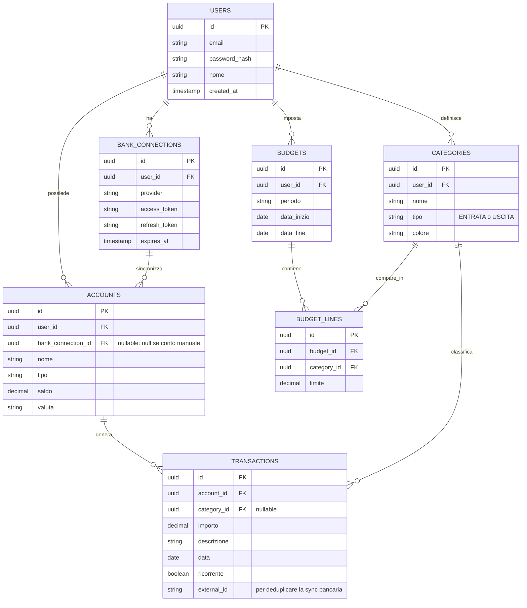

# Budget App

App personale di gestione del budget, con sincronizzazione bancaria (Open Banking) e visualizzazione delle spese tramite grafici. Progetto sviluppato in autonomia come esercizio di apprendimento su Spring Boot, PostgreSQL e Angular.

## Stack tecnologico

| Livello | Tecnologia |
|---|---|
| Backend | Java 21, Spring Boot, Spring Data JPA / Hibernate, Spring Security (JWT custom), Flyway |
| Database | PostgreSQL 16 |
| Frontend web | Angular |
| Frontend mobile | Ionic + Capacitor (stesso codice Angular, nessun framework nuovo da imparare) |
| Integrazione bancaria | Aggregatore Open Banking (GoCardless Bank Account Data, ex Nordigen) — PSD2 |

## Architettura



Il backend fa da intermediario con l'aggregatore Open Banking: non gestisce mai direttamente le credenziali bancarie dell'utente, quell'autenticazione (OAuth) è delegata all'aggregatore.

## Perché queste scelte

- **Ionic/Capacitor invece di Flutter o React Native**: riusa gli stessi componenti e servizi Angular della web app, senza dover imparare un secondo framework mobile da zero.
- **GoCardless Bank Account Data**: copre le banche italiane, ha un piano gratuito adatto a un progetto personale.
- **JWT fatto in casa invece di Keycloak/Auth0**: scelta deliberata per imparare Spring Security a fondo, non solo configurarlo.
- **DTO separati dalle entità JPA**: i controller non restituiscono mai le entità direttamente, per non esporre campi sensibili (es. `passwordHash`) e per non legare la forma dell'API alla struttura delle tabelle.
- **404, non 403, per risorse di altri utenti**: un 403 confermerebbe implicitamente che la risorsa esiste ma non è tua — informazione che regali a chi sta provando ID a caso. Le query di lettura filtrano sempre per `id` **e** `userId` insieme.
- **`ddl-auto: validate` + Flyway**: lo schema del database è sempre sotto controllo di versione esplicito nelle migrazioni; Hibernate non genera né modifica mai la struttura delle tabelle da solo.

## Schema del database



**Nota sulla relazione budget↔categorie**: non è una relazione diretta uno-a-molti, ma passa da una tabella ponte, `budget_lines`. Le categorie sono permanenti e riutilizzabili nel tempo (usate per classificare le transazioni per anni), mentre i budget sono periodici (un limite valido per un mese/anno specifico). La stessa categoria compare in tanti budget diversi nel tempo, e ogni budget contiene più categorie con un limite ciascuna — da qui la tabella ponte, con vincolo `UNIQUE(budget_id, category_id)`.

## Autenticazione

JWT stateless, implementato senza provider esterni:

- `POST /api/auth/register` e `POST /api/auth/login` sono pubblici, restituiscono un token.
- Ogni altra richiesta deve portare `Authorization: Bearer <token>`.
- Il token viene validato da un filtro (`JwtAuthenticationFilter`) prima di ogni richiesta; se valido, l'utente autenticato viene reso disponibile ai controller tramite `@AuthenticationPrincipal CustomUserDetails`.
- Nessuna sessione lato server: ogni richiesta è autenticata indipendentemente dalle altre.
- Per ora esiste un solo ruolo fisso (`ROLE_USER`) — nessuna distinzione di permessi tra utenti.
- Nessun refresh token per ora: il token ha una scadenza breve (`app.jwt.expiration-minutes`), e va rifatto login quando scade. Verrà introdotto quando il frontend sarà pronto a gestirlo.

## Setup locale

Prerequisiti: JDK 21, Docker Desktop (con backend WSL2 su Windows), Node.js LTS, Angular CLI.

1. Avvia PostgreSQL: `docker compose up -d` (usa `docker-compose.yml` nella radice del progetto).
2. Genera una chiave segreta per firmare i JWT e incollala in `application.yml` come default di sviluppo (vedi commento nel file per il motivo):
   ```powershell
   $bytes = New-Object byte[] 32
   (New-Object Security.Cryptography.RNGCryptoServiceProvider).GetBytes($bytes)
   [Convert]::ToBase64String($bytes)
   ```
3. `mvn clean install` dentro `budget-app-backend/`.
4. Avvia l'app (`mvn spring-boot:run`, o Run da VS Code). Flyway applica automaticamente le migrazioni in `src/main/resources/db/migration`.

## Roadmap

- [x] Setup ambiente (Docker Postgres, progetto Spring Boot, Angular CLI)
- [x] Schema del database e migrazioni Flyway
- [x] Autenticazione JWT (registrazione, login)
- [x] CRUD completo per `Account` (con controllo di ownership)
- [x] CRUD completo per `Category`
- [x] CRUD completo per `Transaction`
- [x] Frontend Angular di base (routing, login, shell dashboard)
- [x] Grafici sulla dashboard (spese per categoria, andamento mensile)
- [x] Integrazione Open Banking (Enable Banking, sync schedulato)
- [ ] Gestione budget e alert di superamento soglia
- [x] Wrap mobile con Ionic/Capacitor
- [ ] Deploy

## Convenzioni di progetto

- **Struttura dei package** (backend): un package per entità/dominio (`user`, `account`, `category`, `transaction`, `auth`, `security`, `common`), non per tipo tecnico — ogni package contiene entità, repository, service, controller e DTO relativi a quel dominio.
- **Ownership**: mai fidarsi di uno `userId` passato dal client (body, query param, path); viene sempre estratto dal token JWT verificato tramite `@AuthenticationPrincipal`. Le query di lettura/modifica/cancellazione filtrano sempre per `id` **e** `userId` in un'unica interrogazione.
- **Gestione errori**: centralizzata in `GlobalExceptionHandler` (`common`), che traduce le eccezioni di dominio (`ResourceNotFoundException`, `BadCredentialsException`, ecc.) in risposte HTTP pulite, mai stack trace grezzi verso il client.
- **DTO come record**: preferiti alle classi tradizionali per i DTO di richiesta/risposta — supportati nativamente da Jackson per la serializzazione, meno boilerplate.